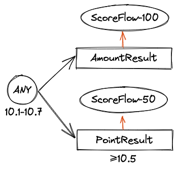

[](https://www.apache.org/licenses/LICENSE-2.0.html)
[](http://waitmoon.com/docs)

# 快速上手

>快来接入使用吧~

## 安装依赖

安装mysql，**新建ice数据库**用于存储配置

```sql
CREATE DATABASE IF NOT EXISTS ice Character Set utf8mb4;
```

**备注：** 如果启动时报找不到ice相关的表，则需手动创建ice相关表结构，表结构sql地址：

[/ice-server/src/main/resources/sql/ice.sql](/ice-server/src/main/resources/sql/ice.sql)

## 安装server

### 下载安装包

[http://waitmoon.com/downloads/](http://waitmoon.com/downloads/)

解压tar包

tar -xzvf ice-server-*.tar.gz

### 编辑配置文件

application-prod.yml

```yml
server:
  port: 8121 #端口
spring:
  datasource: #数据库配置
    url: jdbc:mysql://127.0.0.1:3306/ice?autoReconnect=true&useUnicode=true&characterEncoding=UTF-8&zeroDateTimeBehavior=convertToNull&serverTimezone=Asia/Shanghai&useSSL=false
    username: username
    password: password
    initialization-mode: always
ice:
  port: 18121 #与客户端通信端口
  pool: #线程池配置(用于更新client)
    core-size: 4
    max-size: 4
    keep-alive-seconds: 60
    queue-capacity: 60000
```

### 启动/停止/重启server

启动
**sh ice.sh start**

停止
**sh ice.sh stop**

重启
**sh ice.sh restart**

### 打开配置后台

http://localhost:8121/

### 示例后台参考

部署用于测试&体验地址(仅app=1有真实部署的client)

[http://waitmoon.com](http://waitmoon.com)

## Client接入(Spring)

参考github ice-test模块

### 增加pom依赖

```xml
<dependency>
  <groupId>com.waitmoon.ice</groupId>
  <artifactId>ice-client-spring-boot-starter</artifactId>
  <version>1.0.3</version>
</dependency>
```

### 增加ice配置

```yml
ice: #ice client配置
  app: 1 #与后台配置app对应
  server: 127.0.0.1:18121 #server 地址(serverHost:serverPort)
  scan: com.ice.test #用于扫描叶子节点，多个包用','分隔(默认扫描全部，扫描全部会拖慢应用启动速度)
  pool: #线程池配置(用于并发关系节点)
    parallelism: -1 #默认-1,≤0表示采用默认配置
```

## Client接入(非Spring)

### 增加pom依赖

```xml
<dependency>
  <groupId>com.waitmoon.ice</groupId>
  <artifactId>ice-core</artifactId>
  <version>1.0.3</version>
</dependency>
```

### 运行Client

```java
IceNioClient iceNioClient = new IceNioClient(1, "127.0.0.1:18121", "com.ice.test"); //传入app、server地址和叶子节点扫描路径
iceNioClient.connect(); //连接远程server，初始化ice配置
iceNioClient.destroy(); //应用关停后最好清理一下~
```

## 开发&配置

>参考github ice-test模块

视频地址：[https://www.bilibili.com/video/BV1Q34y1R7KF](https://www.bilibili.com/video/BV1Q34y1R7KF)

# 项目简介

视频地址：[https://www.bilibili.com/video/BV1hg411A7jx](https://www.bilibili.com/video/BV1hg411A7jx)

## 背景介绍

业务中是否写了大量的 if-else？是否受够了这些 if-else 还要经常变动？
业务中是否做了大量抽象，发现新的业务场景还是用不上？
是否各种调研规则引擎，发现不是太重就是接入或维护太麻烦，最后发现还是不如硬编码？
接下来给大家介绍一款全新的开源规则引擎——ice，以一个简单的例子，从最底层的编排思想，阐述 ice 与其他规则引擎的不同；讲述 ice 是如何使用全新的设计思想，契合解耦和复用的属性，还你最大的编排自由度。

## 设计思路

为了方便理解，设计思路将伴随着一个简单的充值例子展开。

### 举例

X公司将在国庆放假期间，开展一个为期七天的充值小活动，活动内容如下：

**活动时间：**(10.1-10.7)

**活动内容：**

充值100元 送5元余额 (10.1-10.7)

充值50元   送10积分 (10.5-10.7)

**活动备注：** 不叠加送(充值100元只能获得5元余额，不会叠加赠送10积分)

简单拆解一下，想要完成这个活动，我们需要开发如下模块：


如图，当用户充值成功后，会产生对应充值场景的参数包裹Pack(类Activiti/Drools的Fact)，包裹里会有充值用户的uid，充值金额cost，充值的时间requestTime等信息。我们可以通过定义的key，拿到包裹中的值(类似map.get(key))。

模块怎么设计无可厚非，重点要讲的是后面的怎么编排实现配置自由，接下来将通过已有的上述节点，讲解不同的规则引擎在核心的编排上的优缺点，并比较ice是怎么做的。

### 流程图式实现

类Activiti、 Flowable实现：


流程图式实现，应该是我们最常想到的编排方式了~ 看起来非常的简洁易懂，通过特殊的设计，如去掉一些不必要的线，可以把UI做的更简洁一些。但由于有时间属性，其实时间也是一个规则条件，加上之后就变成了：


看起来也还好

### 执行树式实现

类Drools实现(When X Then Y)：


这个看起来也还好，再加上时间线试试：


依旧比较简洁，至少比较流程图式，我会比较愿意修改这个。

### 变动

上面两种方案的优点在于，可以把一些零散的配置结合业务很好的管理了起来，对配置的小修小改，都是信手拈来，但是真实的业务场景，可能还是要锤爆你，有了灵活的变动，一切都不一样了。

#### 理想

*不会变的，放心吧，就这样，上*

#### 现实

①充值100元改成80吧，10积分变20积分吧，时间改成10.8号结束吧（*微微一笑*，毕竟我费了这么大劲搞规则引擎，终于体现到价值了！）

②用户参与积极性不高啊，去掉不叠加送吧，都送（*稍加思索*，费几个脑细胞挪一挪还是可以的，怎么也比改代码再上线强吧！）

③5元余额不能送太多，设置个库存100个吧，对了，库存不足了充100元还是得送10积分的哈（*卒…*早知道还不如硬编码了）

以上变动其实并非看起来不切实际，毕竟真实线上变动比这离谱的多的是，流程图式和执行树式实现的主要缺点在于，牵一发而动全身，改动一个节点需要瞻前顾后，如果考虑不到位，很容易弄错，而且这还只是一个简单的例子，现实的活动内容要比这复杂的多的多，时间线也是很多条，考虑到这，再加上使用学习框架的成本，往往得不偿失，到头来发现还不如硬编码。

怎么办？

### ice是怎么做的？

#### 引入关系节点

关系节点为了控制业务流转

**AND**

所有子节点中，有一个返回false 该节点也将是false，全部是true才是true，在执行到false的地方终止执行，类似于Java的&&

**ANY**

所有子节点中，有一个返回true 该节点也将是true，全部false则false，在执行到true的地方终止执行，类似于Java的||

**ALL**

所有子节点都会执行，有任意一个返回true该节点也是true，没有true有一个节点是false则false，没有true也没有false则返回none，所有子节点执行完毕终止

**NONE**

所有子节点都会执行，无论子节点返回什么，都返回none

**TRUE**

所有子节点都会执行，无论子节点返回什么，都返回true，没有子节点也返回true(其他没有子节点返回none)

#### 引入叶子节点

叶子节点为真正处理的节点

**Flow**

一些条件与规则节点，如例子中的ScoreFlow

**Result**

一些结果性质的节点，如例子中的AmountResult，PointResult

**None**

一些不干预流程的动作，如装配工作等，如下文会介绍到的TimeChangeNone

有了以上节点，我们要怎么组装呢？


如图，使用树形结构(对传统树做了镜像和旋转)，执行顺序还是类似于中序遍历，从root执行，root是个关系节点，从上到下执行子节点，若用户充值金额是70元，执行流程：

```[ScoreFlow-100:false]→[AND:false]→[ScoreFlow-50:true]→[PointResult:true]→[AND:true]→[ANY:true]```

这个时候可以看到，之前需要剥离出的时间，已经可以融合到各个节点上了，把时间配置还给节点，如果没到执行时间，如发放积分的节点10.5日之后才生效，那么在10.5之前，可以理解为这个节点不存在。

#### 变动的解决

对于①直接修改节点配置就可以

对于②直接把root节点的ANY改成ALL就可以(叠加送与不叠加送的逻辑在这个节点上，属于这个节点的逻辑就该由这个节点去解决)

对于③由于库存的不足，相当于没有给用户发放，则AmountResult返回false，流程还会继续向下执行，不用做任何更改

再加一个棘手的问题，当时间线复杂时，测试工作以及测试并发要怎么做？

一个10.1开始的活动，一定是在10.1之前开发上线完毕，比如我在9.15要怎么去测试一个10.1开始的活动？在ice中，只需要稍微修改一下：


如图，引入一个负责更改时间的节点TimeChangeNone(更改包裹中的requestTime)，后面的节点执行都是依赖于包裹中的时间即可，TimeChangeNone类似于一个改时间的插件一样，如果测试并行，那就给多个测试每人在自己负责的业务上加上改时间插件即可。

#### 特性

为什么这么拆解呢？为什么这样就能解决这些变动与问题呢？

其实，就是使用树形结构解耦，流程图式和执行树式实现在改动逻辑的时候，不免需要瞻前顾后，但是ice不需要，ice的业务逻辑都在本节点上，每一个节点都可以代表单一逻辑，比如我改不叠加送变成叠加送这一逻辑就只限制在那个ANY节点逻辑上，只要把它改成我想要的逻辑即可，至于子节点有哪些，不用特别在意，节点之间依赖包裹流转，每个节点执行完的后续流程不需要自己指定。

因为自己执行完后的执行流程不再由自己掌控，就可以做到复用：


如图，参与活动这里用到的TimeChangeNone，如果现在还有个H5页面需要做呈现，不同的呈现也与时间相关，怎么办？只需要在呈现活动这里使用同一个实例，更改其中一个，另一个也会被更新，避免了到处改时间的问题。

同理，如果线上出了问题，比如sendAmount接口挂了，由于是error不会反回false继续执行，而是提供了可选策略，比如将Pack以及执行到了哪个节点落盘起来，等到接口修复，再继续丢进ice重新跑即可(由于落盘时间是发生问题时间，完全不用担心活动结束了的修复不生效问题)，同样的，如果是不关键的业务如头像服务挂了，但是依然希望跑起来，只是没有头像而已，这样可以选择跳过错误继续执行。这里的落盘等规则不细展开描述。同样的原理也可以用在mock上，只需要在Pack中增加需要mock的数据，就可以跑起来。

#### 引入前置节点



上面的逻辑中可以看到有一些AND节点紧密绑定的关系，为了视图与配置简化，增加了前置(forward)节点概念，当且仅当前置节点执行结果为非false时才会执行本节点，语义与AND相连的两个节点一致。

## 交流探讨

有兴趣的小伙伴欢迎入群一起探讨交流~

个人微信(因微信群超过200人，加我微信邀请入群~)：


# 详细指南

>快来接入使用吧~

## 节点开发

ice中有三种叶子节点类型，对应三种业务抽象

- *Flow 用于能控制业务流转的抽象，如各种判断或过滤条件，有明确的true和false返回
- *Result 用于一些结果的抽象，如发放各种奖励，有较为明确的true和false返回(如在奖励发放中，发了应该返回true，没发应该返回false)
- *None 用于一些无关业务流转的抽象，如查询信息，无返回值

节点开发过程中，选用自己需要的抽象叶子节点继承并实现对应方法即可。
- BaseLeaf* 使用IceContext作为方法入参，需要实现do*方法
- BaseLeafPack* 使用IcePack作为方法入参，需要实现doPack*方法
- BaseLeafRoam* 使用IceRoam作为方法入参，需要实现doRoam*方法

**例：**
```java
/**
 * 发放余额节点
 */
@Data
@EqualsAndHashCode(callSuper = true)
public class AmountResult extends BaseLeafRoamResult { //需要发放的uid从roam获取，因此继承BaseLeafRoamResult即可

    @Resource
    private SendService sendService; //如果是spring应用，可以直接使用springbean，非Spring应用请初始化IceBeanUtils的IceBeanFactory用于装配自己需要的实例

    private String key; //可供配置的uidKey

    private double value; //可供配置的发放余额值value

    @Override
    protected boolean doRoamResult(IceRoam roam) { //需要实现doRoamResult(即自己的业务内容)
        Integer uid = roam.getMulti(key); //从roam里拿到需要发放余额的用户uid
        if (uid == null || value <= 0) {
            return false;
        }
        boolean res = sendService.sendAmount(uid, value); //调用第三方接口发放余额(给uid发value值的余额)
        roam.put("SEND_AMOUNT", res); //业务中想把发放结果再放回roam，也许供后续使用
        return res; //返回发放结果
    }
}
```

## 执行Ice

### 组装IcePack

pack为执行ice前需要组装的包裹

- **iceId** 需要触发的规则id，对应配置后台的ID，iceId只能触发一条配置的规则
- **scene** 需要触发的场景，所有订阅该场景的规则都会触发
- **confId** 以任意节点ID为root触发规则
- **requestTime** 请求时间，默认System.currentTimeMillis()
- **roam** 放入执行规则所需的参数等信息
- **traceId** 链路ID，默认自动生成
- **debug** 日志打印，参考DebugEnum 最终执行的debug为 handler.debug|pack.debug

### 调用Ice方法

- **void syncProcess(IcePack pack)** 同步执行
- **List\<Future\<IceContext\>\> asyncProcess(IcePack pack)** 异步执行并返回futures

业务中可能会往roam中又放入了执行结果等信息，在执行结束后可以从roam里获得想要的数据。

## IceRoam

roam提供了节点执行所需的数据源或存放执行结果供后续执行使用，roam为ConcurrentHashMap的扩展。

- **put/get** 重写了ConcurrentHashMap的put/get，忽略了ConcurrentHashMap的key/value空指针异常
- **putValue/getValue** 忽略了类型匹配校验，节约了强转操作，使用时注意类型是否匹配
- **putMulti/getMulti** 使用"."分隔并构建拥有层级关系型的数据结构
- **getUnion** 如果参数是以"@"开头的字符串会去roam里拿数据并返回，否则返回参数自身

```java
roam.putValue("a", 1); //{"a":1}
roam.getValue("a"); //1
roam.putMulti("b.c", 2); //{"a":1,"b":{"c":2}}
roam.putMulti("b.d", 3); //{"a":1,"b":{"c":2,"d":3}}
roam.getMutli("b"); //{"c":2,"d":3}
roam.getMutli("b.c"); //2
roam.getUnion("a"); //"a"
roam.getUnion("@a"); //1
roam.getUnion(1); //1
roam.put("e", "@a");
roam.getUnion("@e");//1
roam.put("e", "a");
roam.getUnion("@e");//"a"
```

## 后台配置

视频地址：[https://www.bilibili.com/video/BV1Q34y1R7KF](https://www.bilibili.com/video/BV1Q34y1R7KF)

### app

app用于区分不同的应用，如app=1的ice-test，在ice-test启动时，会根据配置去ice-server拉取app为1的所有配置并初始化

### 新增ice

- **ID** iceId 可以通过iceId触发
- **名称** 描述
- **场景** 订阅的场景，可用","分隔订阅多个场景，当任一场景发生时触发
- **配置ID** ice树的root节点Id
- **Debug** 日志打印，参考DebugEnum，将需要打印的内容对应的值进行累加，如想要打印IN_PACK(执行ice前的Pack-1)和PROCESS(执行过程-2)
- **操作**
- - **编辑** 编辑ice
- - **查看详情**  查看详细节点配置
- - **备份** 备份配置
- - **备份历史** 可以从历史备份中恢复
- - **导出** 导出当前配置(包含未发布的变更)

### 配置节点

单击节点，弹出相关操作

- **查看/编辑节点**
- **添加子节点** 仅限关系关系节点
- **添加前置节点** 添加前置执行节点
- **转换节点** 可将当前节点转换成任意节点
- **上下移节点** 移动节点
- **删除本节点** 节点的删除为软删除，只是断开连接，并未物理删除，可通过添加节点ID的方式添加回来

**其他配置：**
- **confName** 叶子节点的类名，第一次添加的叶子节点需要手动输入全类名，并会有校验该类是否在client中真实存在，添加叶子节点时需要有一个运行中的client用于校验
- **节点ID** 通过节点ID的方式添加子节点即为对象级别复用性的体现，ID相同的节点在内存中只会有一份，更改其中之一其余的都会一起变化
- **debug** 节点的debug仅用于在processInfo中是否展现
- **invers** 反转节点，如节点本该返回false，反转后会返回true，如此ContainsFlow等节点类就不需要再额外开发一个NotContainsFlow

### 发布、清除、导入、导出

- **发布** 所有的变更只有在发布后才会真实的热更新到client中，未发布的变更节点会有"^"标识
- **清除** 清除所有变更，恢复到上次发布版本
- **导入** 导入配置
- **导出** 导出当前配置(包含未发布的变更)
- **实例选择**
- - **Server** server配置，目前仅Server模式下支持编辑操作
- - **Client:host/app/uniqueId** 对应client中真实的配置展现，仅支持查看操作

## 与表达式引擎结合

ice可以融合如Aviator等各种表达式引擎，简化节点配置。

**例：**
以Aviator为例，如果想要做一个基于Aviator的Flow节点：

```java
@Data
@EqualsAndHashCode(callSuper = true)
public class AviatorFlow extends BaseLeafRoamFlow {

    private String exp;//可供配置与热更新的Aviator表达式

    private Expression compiledExpression;

    @Override
    protected boolean doRoamFlow(IceRoam roam) {
        return (boolean) compiledExpression.execute(roam);
    }

    public void setExp(String exp) { //为了更好的性能，设置/更新表达式时重新编译
        this.exp = exp;
        this.compiledExpression = AviatorEvaluator.compile(exp);
    }
}
```

## 节点报错处理

- **统一处理：IceErrorHandle**

设置IceErrorHandle的handle实例(继承IceErrorHandle并实现handle方法)，```IceErrorHanele.setHandle(IceErrorHandle customHandle)```改变所有的节点统一error处理；默认实现为DefaultIceErrorHandle：直接返回NodeRunStateEnum.SHUT_DOWN，不处理并终止整个流程。

- **叶子节点重写errorHandle方法**

叶子节点重写```NodeRunStateEnum errorHandle(IceContext cxt, Throwable t)```方法，处理当前叶子节点发生的error，如果返回NodeRunStateEnum.SHUT_DOWN将会终止整个流程。叶子节点如果重写了errorHandle方法。就不会再走统一error处理，不过可以通过```super.errorHandle(cxt, t)```再走一遍统一处理。

- **配置处理**

节点提供了iceErrorStateEnum配置，如果该配置非空，它的优先级最高，将首先使用配置作为返回值。配置处理只会影响返回值，依然会执行叶子节点重写的errorHandle方法/统一的handle处理方法。


# 常见问题

## Ice

- **ice可以直接用来做工作流吗？**

ice本身是无状态的，如果需要做工作流引擎，还需要二次开发封装。
ice是一种抽象编排方式，类似于抽象一个方法，理论上代码能写的，ice都可以做。

## Client

- **client与server网络故障会导致配置无法热更新吗？**

client默认5s向server发送一个心跳，server在20s内没有收到client心跳会关闭连接，当client网络恢复重新与server建立连接成功后，会全量的拉取配置数据更新一次。因此不必担心网络问题导致的配置不更新问题，但仍需要注意断网这段时间内的配置不统一。

### 日志信息

- **启动报错**

```
Caused by: java.lang.RuntimeException: ice connect server error server:127.0.0.1:18121
	at com.ice.core.client.IceNioClient.connect(IceNioClient.java:95)
	at com.ice.client.config.IceNioClientApplication.run(IceNioClientApplication.java:24)
	at org.springframework.boot.SpringApplication.callRunner(SpringApplication.java:782)
	... 5 common frames omitted
Caused by: io.netty.channel.AbstractChannel$AnnotatedConnectException: Connection refused: /127.0.0.1:18121
Caused by: java.net.ConnectException: Connection refused
```

连接server失败，需要检查server的配置是否正确，和server的通信端口是否互通。

- **配置更新报错**

一般为节点初始化失败错误，此类报错不会终止client启动

```
ERROR (IceConfCache.java:62)- class not found conf:{"id":118,"type":6,"confName":"*.*.*Flow"}
```

节点初始化error，在该client中未找到对应的节点类，请检查节点类是否正常或app配置是否正常。

```
ERROR (IceConfCache.java:91)- sonId:73 not exist please check! conf:{"id":70,"sonIds":"73,74","type":1}
```

节点初始化error，未找到对应id的子节点，一般为子节点初始化失败导致。

以上报错的节点如果未在业务中使用，可以忽略，如果使用了请检查。(后续会出垃圾节点回收，可直接回收不再使用的节点)


## Server
- **server挂了会影响client吗？**

server仅负责配置的操作、存储与热更新，clinet在运行时不依赖server，server宕机后，会导致新的client无法启动(无法与server连通也就无法初始化配置)以及无法操作配置后台。